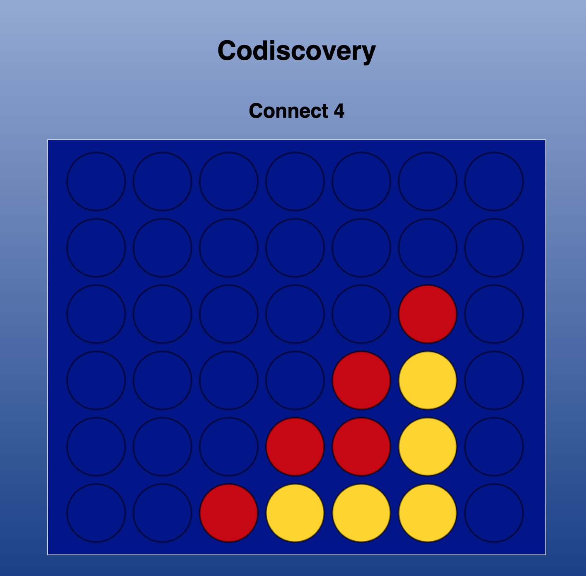

# Connect 4

- Codiscovery
- Live (mercredi 19h-21h) proposé par vous
  - Start from scratch
- Physionomie des lives
  - Questions/Suggestions/Changements appréciées à tout moment (Twitch/Youtube/FB)
  - A partir 21h, réponse à vos questions (avec ou sans rapports avec le live. Ex : le métier, les formations, quel langage/framework apprendre ?)
  - Partie 1 : explication, partie 2 : code
- Si vous aimez :
  - refaire le code vous même + review
  - parlez en autour de vous et abonnez-vous :) (Twitch, Twitter, Youtube, FB, Meetup)

## Steps

### Part 1

- Play in the console
- Check winning grid: https://stackoverflow.com/a/38211417

### Part 2

- Display grid
- Styling
- Check draw

## Participate

- [Code share](https://codiscovery-code-share.herokuapp.com/)
- [Community](https://community.codiscovery.co/)

- Check winning grid
  - vertical,
  - horizontal,
  - diag tl to br,
  - diag tr to bl
- Render grid fn

## Questions

## Reviews

- Roni code review 1 : https://github.com/nobalpha/coeus
- Roni code review 2 : https://github.com/nobalpha/count

const viewers = ['Julie', 'Adeline', 'Mamad'];
viewers[0] // Julie
viewers[1] // Adeline
viewers[2] // Mamad

const grid = [
['A1', null, null, null, null, null, null],
[null, null, null, null, null, null, null],
[null, null, null, null, null, null, null],
[null, 'R', 'Y', null, null, null, null],
[null, 'R', 'Y', null, null, null, null],
[null, 'R', 'Y', null, null, null, null],
]
